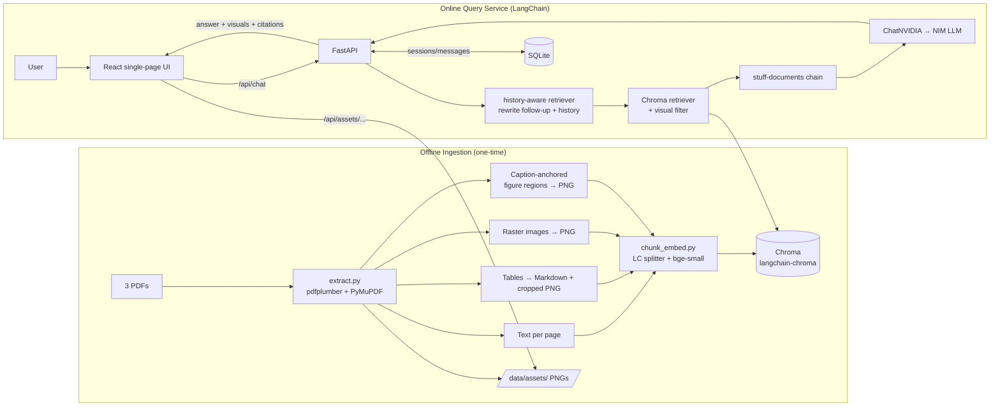

# Implementation Plan — RAG Chatbot over Annual Reports

## Context

We are building a **demo RAG chatbot** that answers questions strictly from 3 annual-report PDFs
(in `pdf_for_RAG/`, ~47–91 MB each) and, when relevant, returns the **tables, graphs, and images**
from those PDFs alongside the text answer. It must be lightweight, local/offline-friendly where
possible, and not over-engineered. Chat sessions persist locally so a user can reopen a previous
conversation and see prior responses. The UI is a single chatbot page.

**Confirmed decisions:**
- **Generation LLM:** NVIDIA NIM cloud API (free tier, `https://integrate.api.nvidia.com/v1`, OpenAI-compatible),
  accessed via LangChain's `ChatNVIDIA`. **Model name + API key + base URL live in `.env`** so they can be
  swapped with zero code changes.
- **Orchestration: LangChain.** Even though today's flow is a straightforward single RAG chain, we build it on
  **LangChain** now so we can later add functionality as **agents** (LangGraph) without re-plumbing. We keep it
  lightweight — one composable RAG chain now, agent-ready seam for later (no multi-agent system built yet).
- **App structure:** React + Vite + Tailwind frontend + FastAPI backend, built as a **fresh standalone project**.
  (`ClassMateAIDemo` in this workspace is a *separate* project — a conventions reference only, not a code source.)
- **Visual extraction:** Lightweight, **no vision model** — embedded raster images (PyMuPDF) + ruled tables
  (pdfplumber → Markdown + cropped PNG) + **caption-anchored page-region rendering** for vector-drawn charts.
- **Embeddings:** Local `BAAI/bge-small-en-v1.5` (384-dim) via LangChain `HuggingFaceBgeEmbeddings` — fully
  offline, free, no rate limits.
- **Follow-ups:** Conversation is context-aware — follow-up questions are **rewritten into standalone queries**
  using chat history (LangChain history-aware retriever) before retrieval.
- **Sessions:** Auto-generated titles (no rename), single local user.

> **Scope of this document:** the agreed implementation plan (approved). Building the application is the
> follow-up step; the sections below define the architecture, decisions, and a step-by-step build sequence.

### PDF Verification Findings (run against the actual PDFs, read-only)

| Report | Pages | Avg chars/page | Verdict | Visual nature |
|---|---|---|---|---|
| Annual_Report_2021_22 | 260 | ~1,655 | **Digital-native** (selectable text) | 47/130 pages heavy **vector** graphics; some raster images |
| Annual_Report_2022_23 | 252 | ~2,012 | **Digital-native** | **128/130** pages heavy vector graphics (very chart-dense) |
| Annual_Report_2023_24 | 284 | ~1,755 | **Digital-native** | 75/130 pages heavy vector graphics; several full-page images |

- **No OCR required.** Near-empty pages are covers/dividers/blank (skipped at ingest), not scanned text.
- **Charts are mostly vector-drawn**, so factual accuracy is carried by **text + tables**; vector charts are
  surfaced as **supplementary visuals via page-region rendering** (no VLM, per the "accurate now, VLM later" call).
- **~796 pages total** → estimated **~1,500–3,000 chunks** (text + tables + images + rendered figures): comfortable
  for ChromaDB + local embeddings (a few minutes to embed on CPU).

---

## 1. System Architecture

Two-phase RAG: an **offline ingestion pipeline** (run once / on PDF change) and an **online LangChain query service**.



**Components**
| Component | Tech | Role |
|---|---|---|
| Ingestion pipeline | Python: pdfplumber, PyMuPDF, LangChain splitter + bge embeddings | PDFs → chunks + assets → Chroma |
| Vector store | ChromaDB via `langchain-chroma` (local persistent dir) | Semantic search over text + visual chunks |
| Embeddings | `HuggingFaceBgeEmbeddings("BAAI/bge-small-en-v1.5")` | Same model for ingest + query |
| RAG orchestration | **LangChain** (history-aware retriever + retrieval chain) | Query rewrite, retrieve, prompt, generate |
| Generation LLM | `ChatNVIDIA` → NVIDIA NIM (env-driven model/key) | Grounded answers |
| Backend API | FastAPI + uvicorn | Endpoints, asset serving, persistence |
| Session DB | SQLite | Persist sessions + messages for reopening |
| Frontend | React 19 + Vite + Tailwind + react-markdown | Single chatbot page with visuals |
| *(future)* Agents | LangGraph | Wrap the RAG chain as a tool; add agents later |

---

## 2. PDF Ingestion & Preprocessing Strategy

- Process each PDF **page-by-page** (PyMuPDF for the page handle + image/region rendering; pdfplumber for
  text/tables on the same page).
- **Provenance on every unit:** `source_pdf` → friendly report year (e.g. `Annual Report 2022-23`) + `page_number`. Drives citations.
- **Skip empty pages:** pages with <~40 chars and no useful image/figure (covers, dividers, blanks).
- **Light cleaning:** collapse whitespace, join hyphenated line breaks, drop repeating header/footer lines.
- **Idempotent:** write a `metadata.json` manifest; `run_ingest.py --reset` clears Chroma + `data/assets/`.
- Embeddings are local → ingestion cost is CPU time only (no API spend / rate limits). Batch-encode + log progress.

---

## 3. Text Extraction Approach

- **Primary:** pdfplumber `page.extract_text()`. **Fallback:** PyMuPDF `page.get_text()` if empty.
- Capture **section headings** via a light font/size heuristic (`page.get_text("dict")`) to enrich chunk metadata.
- Emit **page-level text** + page number; chunking happens in §5.
- **Confirmed digital-native → no OCR.** (A Tesseract fallback remains an easy future add if a new PDF is scanned.)

---

## 4. Table, Graph & Image Extraction Strategy (lightweight, no vision model)

Because these reports are **vector-graphics-heavy**, the strategy has **three** visual sources; factual accuracy
comes from text + tables, with charts shown as supporting visuals.

**Tables (pdfplumber) — primary for financial accuracy:**
- `page.find_tables()` / `extract_tables()` → per table: convert to **Markdown** (embedded + renderable in chat),
  and **crop the table bbox** to PNG via `page.get_pixmap(clip=rect, dpi=150)`.
- Description for embedding = nearest heading/caption + the Markdown table.

**Raster images (PyMuPDF):**
- `page.get_images(full=True)` → save PNGs to `data/assets/<pdf>/p<page>_img<n>.png`.
- **Noise filter:** drop tiny images (w<120 or h<120 px) to skip logos/rules/icons.
- Description = caption text near the image bbox + section heading + nearby paragraph slice.

**Caption-anchored figure regions (handles vector-drawn charts — no VLM):**
- Scan page text for explicit visual captions (`Figure`, `Chart`, `Graph`, `Exhibit`, `Diagram` + number) and/or
  regions dense with vector drawings (`page.get_drawings()`); **render that page region to PNG**.
- Description = the caption + surrounding text. This is how vector charts become viewable/retrievable without a VLM.
- Kept heuristic and conservative (explicit captions first) to avoid noise; tune thresholds during build.

Each table / image / figure becomes a **visual chunk**: metadata `{content_type ∈ [table,image,figure],
asset_path, page, source_pdf, caption}` — a first-class retrievable unit.

---

## 5. Chunking & Embedding Strategy

- **Text chunks:** LangChain `RecursiveCharacterTextSplitter`, ~**400–500 tokens** (~1,600–2,000 chars), ~80-token
  overlap, paragraph/sentence boundaries. Cap sits **at/under the embedding model's 512-token window** (below) so
  chunks aren't silently truncated. Metadata: `content_type="text"`, `source_pdf`, `page`, `section`.
- **Table chunks:** one per table (`content_type="table"`, `asset_path`). **Image/figure chunks:** one each
  (`content_type="image"`/`"figure"`, `asset_path`, `caption`).
- **Embeddings:** `HuggingFaceBgeEmbeddings(model_name="BAAI/bge-small-en-v1.5", encode_kwargs={"normalize_embeddings": True})`.
  This bge-specific LangChain wrapper **auto-applies the query instruction** to `embed_query` while documents are
  embedded as-is — so ingest/query stay consistent. Stored in Chroma via `langchain-chroma`.
- Batch-encode during ingestion.

### Embedding Model Choice & Alternatives — why `bge-small-en-v1.5`

The **same model must embed both documents (ingestion) and queries (runtime)** — mixing models breaks retrieval.
**Selection criteria (local/offline/free):** retrieval quality (MTEB), size/RAM, CPU speed, dimensionality
(storage + query cost), max input length, license.

**Chosen: `BAAI/bge-small-en-v1.5`** — 384-dim, ~130 MB, Apache-2.0: strong quality-per-MB, CPU-friendly, low-dim
(fast Chroma), 512-token window (drives the §5 chunk cap), needs a query instruction (handled by the wrapper).

| Model | Dim | Size | Trade-off vs. chosen |
|---|---|---|---|
| **`bge-small-en-v1.5`** ✅ | 384 | ~130 MB | Chosen — best quality-per-MB at low dim; 512-token cap |
| `all-MiniLM-L6-v2` | 384 | ~90 MB | Fastest baseline, no instruction; weaker retrieval — simple fallback |
| `gte-small` | 384 | ~120 MB | Competitive, no instruction prefix |
| `e5-small-v2` | 384 | ~130 MB | Comparable; `query:`/`passage:` prefixes |
| `bge-base-en-v1.5` | 768 | ~440 MB | Higher quality, ~3× slower, 2× storage — first upgrade |
| `bge-large-en-v1.5` | 1024 | ~1.3 GB | Best bge; slow on CPU — overkill for a demo |
| `nomic-embed-text-v1.5` | 768 | ~550 MB | 8192-token context — pick if embedding long tables without tight chunking |
| `nv-embedqa-e5-v5` (NIM, cloud) | 1024 | — | Better, but rate-limited free tier slows bulk ingest — rejected |
| `text-embedding-3-small` (OpenAI, cloud) | 1536 | — | Excellent but paid + not offline — out of scope |

**Decision rule:** start with `bge-small`; if retrieval is weak, upgrade to `bge-base` and/or add a `bge-reranker`
cross-encoder (§12) — both stay local. If long tables get truncated, switch to long-context `nomic-embed`.

---

## 6. Local Vector Database Choice — ChromaDB

**Choice: ChromaDB (`PersistentClient`, single local dir), wrapped by `langchain-chroma`.**
- **Fully local & offline**, pip-installable, persists to disk; first-class LangChain integration (`.as_retriever`).
- Metadata filtering (`content_type` / `source_pdf` / `page`) for "text vs visual" and per-report queries.
- One **unified collection** (`annual_reports`); right scale for a few thousand chunks; no ops. Alternatives in §12.

---

## 7. Retrieval & Response-Generation Flow (LangChain)

1. **Rewrite follow-up → standalone query:** LangChain `create_history_aware_retriever` condenses the new question
   + chat history into a self-contained query (this is the context-aware follow-up behavior).
2. **Retrieve:** Chroma retriever, `k≈8`. Plus a **visual-targeted** `similarity_search` with
   `filter={"content_type": {"$in": ["table","image","figure"]}}` (k≈3) so visuals surface even when prose dominates.
3. **Generate:** `create_retrieval_chain` + `create_stuff_documents_chain` with a custom grounding prompt:
   *answer ONLY from context; cite as report-year + page; say so if context is insufficient; reference a supporting
   table/figure as `[VISUAL: <asset_id>]`.* One `ChatNVIDIA` call, low temperature.
4. **Post-process:** parse `[VISUAL: id]` → resolve to asset metadata; strip tags from prose; assemble
   `{ answer_markdown, citations[], visuals[] }`.
5. **Rate-limit hygiene** (NIM free tier): retry/backoff, cap context tokens, include only the last N turns, one LLM call.
6. **Persist** the user + assistant turns (with `visuals`/`citations`) to SQLite.

**Agent-ready seam:** this whole chain is built as one composable unit (`backend/chain.py`) that a future LangGraph
agent can call as a tool — no agents built now.

---

## 8. Supporting Answers That Include Visuals

- **Visual chunks are first-class** (tables, raster images, rendered figures), each with a stable `asset_id`, caption, served file.
- **Two surfacing paths, used together:** (1) **LLM-driven** `[VISUAL: id]` tags; (2) **safety net** — attach the top
  visual chunk whose similarity passes a threshold even if untagged.
- Backend returns `visuals[] = [{ id, type, url: /api/assets/..., caption, page, source_pdf }]`; FastAPI serves PNGs at `GET /api/assets/{relpath}`.
- Frontend renders `visuals[]` with caption + click-to-zoom.

---

## 9. Session Storage & Conversation History Design

**SQLite** (`data/app.db`) via FastAPI (lightweight `sqlite3` or SQLModel).

```
sessions(  id TEXT PK, title TEXT, created_at, updated_at )
messages(  id INTEGER PK, session_id FK→sessions.id, role TEXT,
           content TEXT, visuals_json TEXT, citations_json TEXT, created_at )
```

- **Endpoints:** `POST /api/sessions` · `GET /api/sessions` (list, newest first) · `GET /api/sessions/{id}`
  (full history incl. visuals/citations) · `POST /api/chat` (append turn, returns grounded answer) · `DELETE /api/sessions/{id}`.
- **Title:** **auto-generated** from the first user message (truncated) — no rename UI.
- **History → chain:** the last N turns are passed into the history-aware retriever (§7) so follow-ups are context-aware.
- **Frontend:** sidebar lists sessions; click loads history; "New Chat" creates a session; current `session_id` cached in `localStorage`.

---

## 10. Minimal UI — Single Chatbot Page

- **One page, no routing.** Left **sidebar** (session list + "New Chat") + main **chat panel** (message list + input).
- **Components:** `App`, `Sidebar`, `ChatPanel`, `MessageBubble` (markdown via `react-markdown` + `remark-breaks`,
  Tailwind `prose`), `VisualBlock` (image + caption + zoom modal), `ChatInput`.
- **States:** loading while NIM responds, error toast, empty state, per-message citation chips. Deliberately minimal.

---

## 11. Pros & Cons of the Proposed Approach

**Pros**
- Local except the LLM call — free embeddings/vector DB; ingestion isn't throttled by NIM free-tier limits.
- **LangChain** gives a clean, swappable RAG chain (history-aware follow-ups out of the box) and an agent-ready path.
- Metadata-filtered retrieval; **visuals first-class** (incl. vector charts via region render) with citations.
- Persistent, reopenable sessions via a simple SQLite schema; env-driven model/keys.

**Cons / limitations (honest)**
- No VLM: vector-chart visuals rely on **caption/region heuristics** — some charts may be missed or imperfectly cropped
  (mitigated because the underlying numbers live in extractable tables/text).
- pdfplumber tables imperfect on complex/merged-cell layouts.
- NIM free tier adds latency/rate limits; `bge-small` + no reranker set a retrieval-quality ceiling.
- LangChain adds a dependency layer vs. raw calls — accepted deliberately for future agents.

---

## 12. Alternative Approaches & Trade-offs

| Area | Chosen | Alternatives & trade-off |
|---|---|---|
| Orchestration | **LangChain** (chain now, LangGraph later) | Raw SDK calls (less code now, re-plumb later) · LlamaIndex (RAG-focused) · LangGraph-first (more upfront) |
| Generation LLM | NVIDIA NIM via `ChatNVIDIA` | Local Ollama (offline, hardware-bound) · OpenAI (best, paid) |
| Embeddings | `bge-small` local | `bge-base/large` (better, heavier) · cloud embeddings (rate-limited bulk ingest) |
| Vector DB | ChromaDB | FAISS (fast, no metadata store) · LanceDB (multimodal) · Qdrant (heavier) · pgvector (needs Postgres) |
| PDF parsing | pdfplumber + PyMuPDF | Docling / unstructured.io / LlamaParse — better tables & figure detection, heavier — upgrade path |
| Visual understanding | nearby-text + region render | VLM captioning (NIM VLM / LLaVA) — better chart retrieval, heavier — deferred |
| Retrieval quality | top-k dense | add `bge-reranker` and/or hybrid BM25 + dense — accuracy upgrade |

---

## 13. Assumptions

1. PDFs are **digital-native → no OCR** *(verified)*.
2. LLM = **NVIDIA NIM cloud API** via `ChatNVIDIA`; model/key/base-URL in `.env`.
3. **Single local user** — no auth/concurrency concerns.
4. English content.
5. **~796 pages → ~1,500–3,000 chunks**; ChromaDB + local embeddings comfortably sufficient.
6. Charts are largely **vector-drawn**; lightweight region-render visuals are acceptable for the demo (VLM later).
7. Demo-acceptable NIM free-tier latency.
8. **Fresh standalone project** under `RAG System/` (no imports from `ClassMateAIDemo`).
9. **Page-level citations** (report year + page) are sufficient.
10. **LangChain now, multi-agent (LangGraph) later** — only the agent-ready seam is built now.

---

## 14. Resolved Decisions & Items to Validate During Build

**Resolved (from your answers):**
- Scanned? **No — digital-native** (verified). · Pages: **260/252/284**. · Vector charts: **no VLM now**, region-render
  + text/tables for accuracy. · NIM model: **env-driven default**, swappable. · Follow-ups: **history-aware rewriting, yes**. ·
  Session titles: **auto, no rename**. · View-full-source-page: **no**. · Concurrent users: **1**.

**To validate during build (tune, not blockers):**
- Caption/region heuristic coverage for vector charts (does it catch the important graphs?).
- Confirmed NIM model + its free-tier rate limits under real query load.
- Table-extraction fidelity on the densest financial-statement pages (pdfplumber vs. a Docling upgrade if needed).

---

## Proposed Project Structure

```
RAG System/
├── pdf_for_RAG/                 # source PDFs (given)
├── Implementation plan/         # IMPLEMENTATION_PLAN.md
├── ingestion/
│   ├── extract.py               # PDFs → text/tables/images/figures + metadata.json + assets
│   ├── chunk_embed.py           # LC splitter + bge embeddings → Chroma (langchain-chroma)
│   └── run_ingest.py            # orchestrator (--reset)
├── backend/
│   ├── main.py                  # FastAPI app, CORS, routes, /api/assets static
│   ├── chain.py                 # LangChain RAG: history-aware retriever + retrieval chain (agent-ready)
│   ├── llm.py                   # ChatNVIDIA factory (reads .env)
│   ├── embeddings.py            # HuggingFaceBgeEmbeddings loader (shared with ingestion)
│   ├── retriever.py             # Chroma retriever + visual-filter search
│   ├── db.py                    # SQLite sessions/messages
│   └── config.py                # env, paths, model names
├── frontend/                    # React + Vite + Tailwind (single page)
│   └── src/{App.jsx, components/{Sidebar,ChatPanel,MessageBubble,VisualBlock,ChatInput}.jsx}
├── data/{chroma/, assets/, app.db}
├── .env / .env.example          # NVIDIA_API_KEY, NVIDIA_MODEL, NVIDIA_BASE_URL, EMBED_MODEL, paths
└── requirements.txt
```

**`requirements.txt` (key deps):** `langchain`, `langchain-core`, `langchain-community`, `langchain-text-splitters`,
`langchain-chroma`, `langchain-nvidia-ai-endpoints`, `sentence-transformers`, `chromadb`, `pdfplumber`, `PyMuPDF`,
`fastapi`, `uvicorn`, `python-dotenv`, `pydantic`. *(LangGraph added later when agents are introduced.)*

## Step-by-Step Build Sequence

1. **Scaffold** project, venv, `requirements.txt`, `.env.example` (NIM key/model/base-URL, embed model, paths).
2. **`extract.py`** — text + tables (Markdown + crops) + raster images + caption-anchored figure regions →
   `data/assets/` + `metadata.json`; eyeball outputs (esp. that vector charts get rendered).
3. **`chunk_embed.py`** — LangChain splitter + bge embeddings → Chroma; verify counts + a test query.
4. **Backend** — `config.py`, `embeddings.py`, `llm.py` (ChatNVIDIA), `retriever.py`, `chain.py` (history-aware
   retrieval chain), `db.py`, `main.py` (routes + asset serving); test with `curl`.
5. **Frontend** — Vite React single page (sidebar + chat + visuals); wire to backend.
6. **End-to-end test** with demo questions (incl. one needing a table, one needing a chart, and a follow-up).

## Verification (how we'll know it works)

- **PDF check:** ✅ done — digital-native, 796 pages, vector-heavy visuals (informs §4).
- **Ingestion:** `metadata.json` lists text/table/image/figure chunks per PDF; `data/assets/` has non-trivial PNGs
  (including rendered vector-chart regions); Chroma count in the expected range; a CLI test query returns sensible chunks + citations.
- **Retrieval+LLM:** `POST /api/chat` with a fact from a known table returns the right answer + `[Report year, p.X]`
  citation + the table image in `visuals[]`; an out-of-corpus question yields an honest "not in the documents".
- **Follow-ups:** a context-dependent follow-up (e.g. "what about the previous year?") is correctly rewritten and answered.
- **Visuals:** `GET /api/assets/<path>` returns the PNG; frontend renders it with caption + zoom.
- **Sessions:** create a session, ask 2–3 questions, reload, reopen from the sidebar; prior messages **and** their visuals restore from SQLite.
